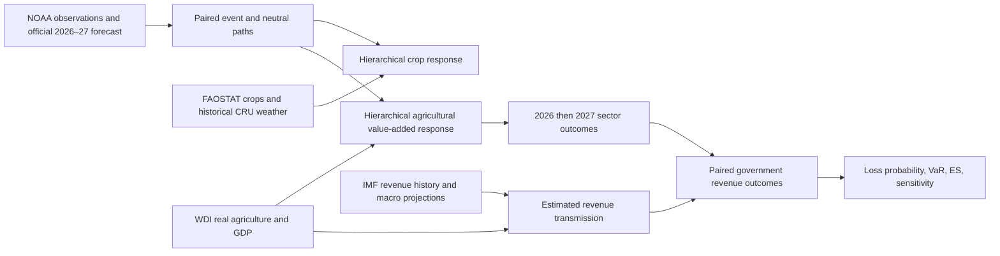

# Tradewinds Sovereign

**An actuarial economic-impact study of the 2026–2027 El Niño event in Pacific agriculture and government revenue.** Python · uv · PyMC · pandas · scikit-learn · Plotly · Streamlit.

[Read the event study](reports/event/index.html) · [Findings](reports/event/FINDINGS.md) · [Methodology](docs/EVENT_METHODOLOGY.md) · [Sources and institutional comparison](docs/EVENT_SOURCES.md)

The primary deliverable now answers a dated event question: **how might government revenue in 2026 and 2027 differ with this El Niño versus a defined neutral-climate counterfactual?** It uses official NOAA forecast probabilities, observed ENSO history, agricultural exposure, and empirically estimated fiscal transmission. It retains the earlier historical crop analyses as supporting research, rather than presenting generic stress tests as the event assessment.

The study covers Indonesia, Malaysia, the Philippines, Thailand, Vietnam, Papua New Guinea, Fiji, Solomon Islands, Vanuatu, Samoa, Tonga and Australia. Crop detail covers oil palm, coconut, sugar cane, rice, maize, cocoa and coffee where the FAOSTAT record passes eligibility checks. Macro agriculture, forestry and fishing value added supplies a separate aggregate economic channel, including islands without recent crop valuation data.

## What the project produces

- Separate 2026, 2027 and cumulative revenue-loss distributions, with probability of loss, revenue-buffer exceedance, VaR95 and ES95. Results retain gains and uncertainty rather than forcing every country to lose.
- Crop yield effects with 2027 carryover, harvested-area and supported local-price responses, and clearly labelled tonnage equivalents. These are not interchangeable with government revenue.
- An official-forecast climate path, a defined no-event counterfactual, and explicit late-2027 continuation/dependence/onset sensitivities.
- Estimated country fiscal elasticities, prior-sensitivity checks, chronological benchmark comparisons, Bayesian holdouts, extrapolation flags and source vintages.
- A portable HTML study, interactive dashboard, CSV outputs, posterior artifacts and an executed event walkthrough notebook.

## Run it

```bash
uv python install 3.12
uv sync --locked --extra dev
uv run tradewinds update
uv run streamlit run app.py
```

`update` now runs the **2026–2027 event pipeline**. `uv run tradewinds event` is an explicit alias. Both refresh official inputs, refit changed training models, run validation/sensitivities and publish a complete dated assessment. First execution downloads the source datasets and fits several four-chain models; it takes longer than subsequent updates.

```bash
uv run tradewinds event --cached   # reproduce from verified cached provider responses
uv run tradewinds event --cached --no-refit  # reuse only if all required fits remain current
uv run pytest -q
```

The daily GitHub Actions workflow runs the same pipeline after this repository is pushed to GitHub and scheduling is enabled there. It is provided here, not represented as already deployed. Source publication lags remain: a daily job cannot manufacture daily crop harvest or annual fiscal observations. Failed refreshes and stale/nonconverged fits leave the prior successful assessment intact.

## How it works



Bayesian partial pooling shares information across countries/crops without assuming identical responses. Warm, neutral and La Niña history enter the analysis, with lagged economic controls and persistence. The fiscal equation controls for non-agricultural growth and estimates an agricultural-growth coefficient; it does **not** multiply gross sales by an assumed 1%–10% capture rate. Details, equations and justifications are in [the event methodology](docs/EVENT_METHODOLOGY.md).

## Interpret the results honestly

These are **conditional event-risk estimates**, not observed 2026–2027 losses, identified causal tax multipliers, or an official nominal budget forecast. Monetary estimates are constant 2025 USD. The government-revenue channel excludes event-driven inflation/FX feedback, emergency spending and broader non-agricultural spillovers. Fiscal reporting-calendar alignment and crop phenology remain approximate.

Converged sampling is necessary but does not establish predictive accuracy. Chronological benchmark and holdout scores are published even when the climate/agriculture models fail to beat simpler baselines. Late-2027 conditions beyond the official forecast horizon are model extensions. Sparse historical super-event analogues and weak fiscal identification can produce wide intervals spanning gains and losses. No agreement with an institutional sovereign-revenue loss forecast is claimed.

## Repository map

| Location | Contents |
|---|---|
| `src/tradewinds/event_*.py` | Official event inputs, climate paths, macro/fiscal models, paired risk, reporting and updates |
| `src/tradewinds/model.py`, `analysis.py`, `weather.py` | Supporting crop, weather and historical validation models |
| `reports/event/` | Reviewable primary event study and results |
| `reports/legacy/` | Archived generic-stress report, not the current event assessment |
| `docs/EVENT_METHODOLOGY.md` | Assumptions, equations, estimation, validation and limits |
| `docs/EVENT_SOURCES.md` | Official datasets and institutional comparisons |
| `notebooks/02_event_assessment.ipynb` | Executed event-study walkthrough |
| `artifacts/runs/` | Immutable successful/failed run records and frozen report data |
| `data/raw/` | Hashed, versioned source responses; excluded from Git |

The older `risk` and `monitor` commands remain for reproducing historical/generic experiments; they do not publish the primary event study. `reports/event` is the checked-in review snapshot. The dashboard follows the latest successful event run recorded in `artifacts/state.json`.

MIT-licensed project code; provider data retain their respective terms.
