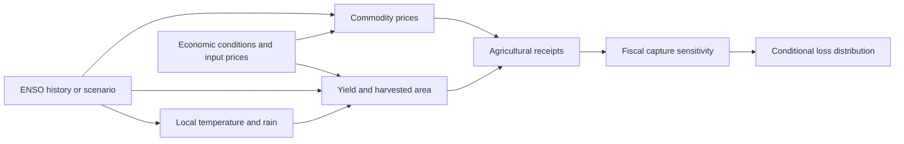

# Scientific and actuarial methodology

## Estimand and scope

Estimate conditional agricultural response distributions under ENSO exposures, then translate
those into **partial fiscal sensitivities**. The implemented outputs are observational associations,
not identified causal effects, total sovereign losses, credit ratings, or default probabilities.
Geography deliberately covers Pacific islands and major Asia-Pacific agricultural producers.



## Features and explanatory models

For country–crop group g in year t:

- y[g,t] = log(yield[g,t]) − log(yield[g,t−1]). Missing calendar years break growth and lags.
- Yield = production tonnes / harvested hectares. Area growth is analyzed separately.
- ENSO features are calendar-center-year means of positive index values, their one- and
  two-year lags, negative index magnitudes, and excess index above 1.5°C.
- The annual “El Niño” descriptive bucket has positive exposure mean ≥0.5°C; La Niña has
  negative magnitude mean ≥0.5°C; otherwise neutral/mixed. These are analytical exposure buckets,
  not NOAA's official event classification. Mixed transition years need careful interpretation.
- Controls: linear trend, lagged yield growth, lagged real GDP growth, and lagged annual oil
  and urea log price changes. Missing controls are training-median imputed with missingness flags.
- Weather specification adds national temperature, log rainfall, driest-month rain, and hottest-month
  mean maximum temperature. Country centering and scaling use training observations only.

The principal Bayesian model is:

```
y[g,t] ~ Normal(mu[g,t], sigma[g])
mu[g,t] = alpha[g] + X_ENSO[t] beta[g] + Z[g,t] gamma
beta[g,k] = beta_crop[crop(g),k] + tau[k] z[g,k]
z[g,k] ~ Normal(0,1)
beta_crop[c,k] ~ Normal(0,0.08)
tau[k] ~ HalfNormal(0.04)
alpha[g] ~ Normal(0,0.05)
gamma[j] ~ Normal(0,0.05)
sigma[g] ~ HalfNormal(0.20)
```

Priors are regularization judgments on log-growth responses, not externally measured coefficients.
The noncentered hierarchy permits sharing across the same crop while retaining country departures.
Normal log-growth errors give finite lognormal moments; empirical shocks, rather than extrapolated
Gaussian tails alone, drive fiscal simulation. Extreme observations and imputed series still matter.

A total-association model excludes weather mediators. A weather-controlled model answers a different
conditional question. Contemporaneous GDP and price controls could absorb pathways we want to
measure, so the baseline uses lagged controls. Remaining global shocks, adaptation, irrigation,
policy, crop mix, and reporting changes can confound the association. Country-year fixed effects
would absorb a globally common ENSO series; adding them without a differential-exposure identification
strategy would not solve that problem.

Why not start with a neural network? Annual labels and relatively few independent ENSO episodes
favor regularized, interpretable partial pooling. A neural network becomes more compelling with
dense spatial weather or remote sensing. Bayesian modeling does not automatically guarantee
calibration or beat simpler predictors. Those are empirical questions.

## Validation

1. Expanding-window conditional hindcasts from 2000 onward. Training ends at t−3, creating a
   two-year publication gap. Realized same-year ENSO/weather and lagged yield are supplied, so
   this is conditional response testing, **not** a simulated information set for an actual t−3 forecast.
2. Historical series means, economic-controls ridge, ENSO ridge with country–crop interactions,
   and weather-augmented ridge use matching observations. Ridge regularization is fixed at 10;
   there is no test-set hyperparameter selection.
3. Report MAE, RMSE, 90% interval coverage, and interval score by phase. Empirical training
   residual intervals are a baseline; their out-of-time performance is explicitly measured.
4. A separately fitted Bayesian historical cutoff evaluates posterior predictive distributions on
   subsequent years, including CRPS. This is distinct from in-sample posterior predictive checking.
5. Check R-hat ≤1.01, bulk ESS ≥400, no divergences, and minimum BFMI ≥0.3 before default risk
   generation. Prior/posterior predictive checks assess dispersion and tail mismatch.

Historical data have revisions. Genuine vintage-based backtests can only accumulate prospectively
unless historical release archives are acquired. Multiple country–crop observations do not create
independent ENSO events. Descriptive phase intervals therefore resample calendar-year aggregates.
Bayesian likelihood errors are conditionally independent: posterior precision can remain optimistic
under unmodeled common shocks. Empirical joint risk shocks mitigate portfolio dependence errors,
but do not repair that inferential limitation.

## Valuation and simulation

Use FAOSTAT's current-USD gross production value of the **exact primary crop**, in one common
baseline year. Never multiply palm-fruit tonnes by palm-oil prices, paddy by milled-rice prices,
or cane by refined-sugar prices. Global prices are a separate market analysis.

Area and local annual USD farmgate-price growth are modeled with ridge ENSO/economic regressions
when at least 20 growth observations exist. A 200-replicate shared-calendar-year bootstrap
approximates their coefficient uncertainty. This is not a fully joint Bayesian yield/price/area model.
Unsupported local price responses are explicitly fixed at zero and listed in `auxiliary_support.csv`.

For simulation s, commodity g, scenario x:

```
receipts_neutral[s,g] = baseline_value[g] × empirical_background_multiplier[s,g]
receipts_x[s,g] = receipts_neutral[s,g] × exp(ENSO_yield + ENSO_area + ENSO_price)
climate_increment[s,g] = capture[s,country(g)] × (receipts_neutral − receipts_x)
baseline_shortfall[s,g] = capture[s,country(g)] × (baseline_value − receipts_x)
```

Neutral multipliers are mean-centered in level space, so average neutral receipts equal baseline.
Scenario and neutral draws share the same background shocks. This is a paired model contrast,
not a causally identified counterfactual. Gains can offset losses within country and portfolio.

Capture rates follow a country-shared triangular distribution (1%, 5%, 10%), explicitly uncalibrated.
One sampled historical residual year is shared across commodities and outcomes; missing residual
cells use independent marginal draws, and their number is reported. Sparse overlap and historical
support limit tail extrapolation. Fiscal denominators require recent matched GDP and revenue years.
No denominator is assigned to a portfolio assembled from countries with incompatible fiscal coverage.

Scenarios: neutral, warm El Niño, cold La Niña, a stylized sustained “super” stress, post-super lagged
exposure, and the current statistical ENSO outlook. The super scenario is a feature vector,
not an official severity classification or a probability forecast. Current outlook exposures combine
observed seasons with AR(2)/persistence paths; one-step rolling error selects that statistical baseline.
Multi-step probabilities are not yet calibrated. Fixed baseline values mean this is updated exposure
sensitivity, not an inflation-adjusted 2026 budget forecast.

Expected shortfall integrates the worst specified empirical probability mass, including a fractional
boundary observation. Insurance outputs price an illustrative indemnity layer on positive fiscal loss;
they are not quoted premiums or a designed parametric contract. Conditional scenario percentiles
must not be described as unconditional return periods.
